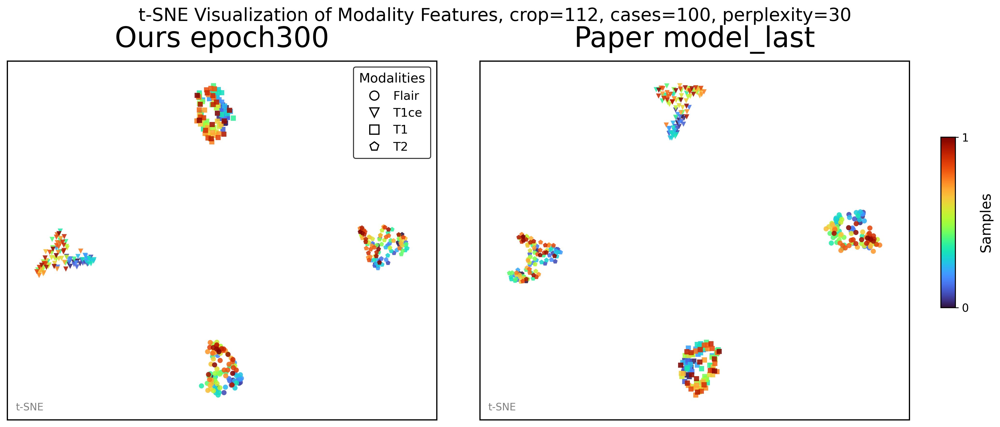
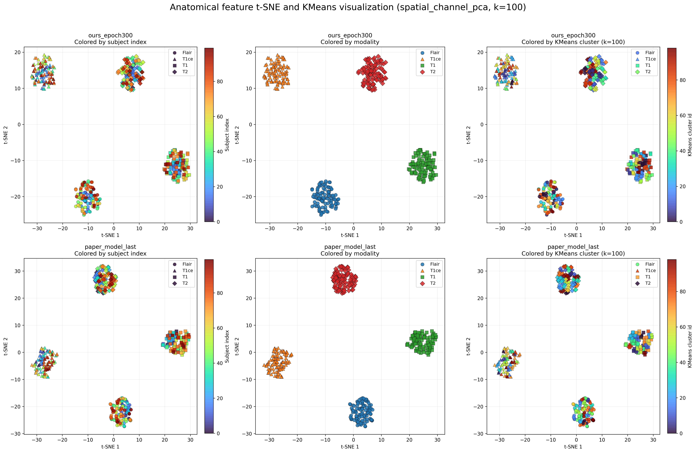
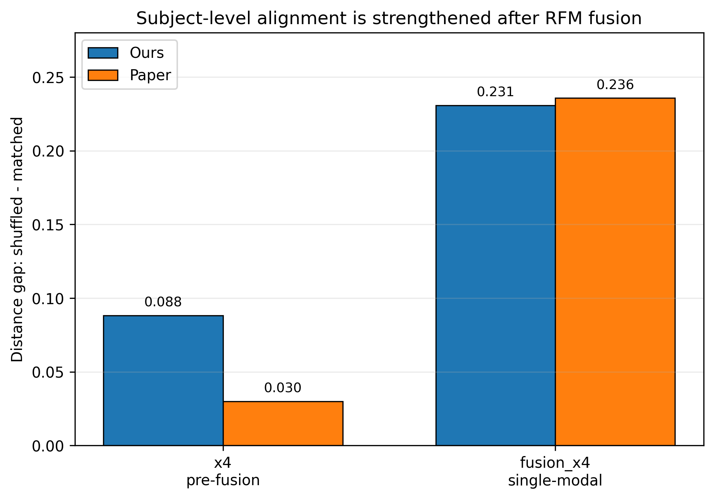
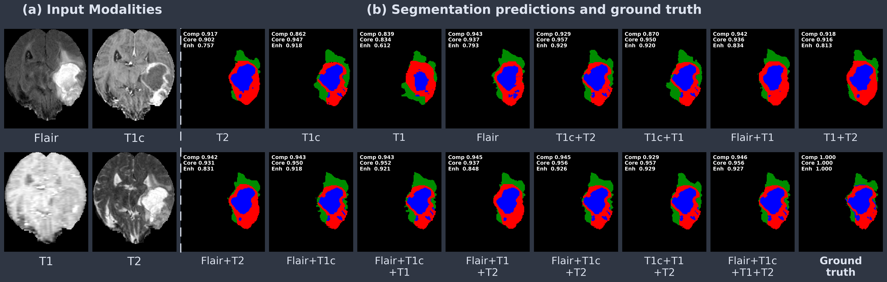

# DC-Seg 复现：缺失模态鲁棒性与表征分析

[English](README.md) | **中文**

本项目在 BraTS2020 上独立复现
[DC-Seg: Disentangled Contrastive Learning for Brain Tumor Segmentation with Missing Modalities](https://papers.miccai.org/miccai-2025/0213-Paper0653.html)，
并进一步分析缺失模态鲁棒性、模型表征与具体误差来源。

本公开仓库仅展示项目的主要结果和汇总分析，与私人工作仓库相互独立。这里不包含数据集、
模型权重、服务器路径、中间 feature arrays、日志或病例级预测文件。

> **核心结论：**复现模型在分割性能和缺失模态退化趋势上接近作者 checkpoint。
> Modality branch 形成了清晰的模态特异性表示；真正明显的病例级 anatomical alignment
> 主要在 **feature fusion 之后**出现，而非直接存在于 fusion 前的 anatomical encoder
> 输出中。

## 项目概览

| 项目 | 设置 |
|---|---|
| 数据集 | BraTS2020 |
| MRI 模态 | FLAIR、T1ce、T1、T2 |
| 缺失模态设置 | 全部 15 种非空模态组合 |
| 测试集 | 100 个病例 |
| 分割区域 | Whole Tumor (WT)、Tumor Core (TC)、Enhancing Tumor (ET) |
| 复现模型 | 300 epochs，45,000 iterations |
| 对照模型 | 作者公开的 `model_last` checkpoint |
| 扩展分析 | 鲁棒性、表征探测、FP/FN 分解、标签转换、模态贡献、failure cases |

## 我完成的工作

1. 重建 BraTS2020 训练和评估流程，包括 modality-mask sampling 与滑窗推理。
2. 在相同 100-case 测试集上评估四种 MRI 模态的全部 15 种非空组合。
3. 对 modality、fusion 前 anatomical 和 fusion 后 anatomical feature 进行聚类和
   matched-versus-shuffled similarity 分析。
4. 使用 FP/FN 统计与标签转换矩阵，将分割误差从 Dice 进一步分解。
5. 在匹配输入上下文中估计每种模态对具体错误转换的抑制作用。
6. 定位缺失模态引入的代表性空间失效模式。

## 复现结果

全部 15 种模态组合上的平均 Dice：

| 模型 | WT | TC | ET（后处理） |
|---|---:|---:|---:|
| 复现模型，epoch 300 | **0.87** | **0.79** | **0.64** |
| 作者 checkpoint | 0.88 | 0.79 | 0.65 |

在 full-modality 输入下，复现模型的 WT / TC / 后处理 ET Dice 为
**0.91 / 0.86 / 0.80**，作者 checkpoint 为 **0.91 / 0.86 / 0.82**。

复现训练的 iteration 数少于作者训练（45,000 对约 55,000）。此外，由于训练分阶段续跑，
polynomial learning-rate schedule 在阶段边界发生了重启。因此，这里的结论是主要推理
行为得到了复现，而不是两次优化过程完全相同。

各模态组合的汇总结果见
[`results/dice_by_modality_mask.csv`](results/dice_by_modality_mask.csv)，其中同时保留
raw ET 与 post-processed ET。

## 缺失模态鲁棒性

相对于 full-modality 输入的平均 Dice drop：

| 可用模态数 | WT drop | TC drop | ET drop |
|---|---:|---:|---:|
| 单模态 | 0.09 | 0.15 | 0.25 |
| 双模态 | 0.03 | 0.07 | 0.14 |
| 三模态 | 0.01 | 0.03 | 0.06 |

- **FLAIR 和 T2** 对水肿与整体 WT 范围最关键。
- **T1ce** 对 TC，尤其是 ET，具有难以替代的作用。
- 增加模态数量能够减轻退化，但无法完全补回关键序列直接提供的病理信息。

## 表征分析

### Modality branch 的解耦非常明显

对 modality feature 进行 K-means，复现模型和作者 checkpoint 的
**ARI = 1.00、NMI = 1.00**；silhouette score 分别为 0.99 和 0.98。



### Fusion 前的 anatomical feature 仍然依赖模态

复现模型的同病例跨模态 similarity 为 0.41，而不同病例同模态 similarity 达到 0.68；
作者 checkpoint 也呈现相同顺序，为 0.40 对 0.57。因此，fusion 前特征虽然包含病例
信息，但不能直接解释为已经完成去模态化的 shared anatomy。



### 病例级对齐主要在 fusion 后出现

| 模型 | 同病例、不同输入 | 不同病例、所有输入 | 不同病例、相同输入 |
|---|---:|---:|---:|
| 复现模型 | **0.64** | 0.43 | 0.49 |
| 作者 checkpoint | **0.65** | 0.43 | 0.47 |



这说明 DC-Seg 的解耦具有明显的 **fusion-dependent** 特征：modality branch 学习清晰的
模态特异空间，而更可信的 shared anatomical representation 在 fusion module 中形成。

## 误差分解与模态贡献

- **WT：**整体由 FP 主导，FLAIR 和 T2 共同维持水肿覆盖。
- **TC：**多数模态组合由 FN 主导；缺少 T1ce 时，真实 core 更容易流向背景或水肿。
- **ET：**FP 问题最突出，同时对 T1ce 缺失最敏感。

标签级分析显示，背景与水肿的 `0 ↔ 2` 交换是 WT 扩张和缩小的重要来源，
NCR/NET 到 enhancing tumor 的 `1 → 3` 混淆则是 ET 过分割的重要来源。

在匹配输入上下文中加入模态后，T1ce 对 enhancing-tumor `3 → 2` 错误的抑制最强
（16.44 个百分点），其次是 NCR/NET `1 → 3`（15.74 个百分点）；FLAIR 和 T2 的主要
作用则体现在抑制 edema `2 → 0`。

## 定性分析

下图在相同切片和配色下比较一个 BraTS2020 病例的全部 15 种 modality masks：



反复出现的失效模式包括：

1. FLAIR/T2 同时缺失时，连续水肿区域转为背景；
2. T1ce 缺失时，enhancing tumor 转入非增强标签；
3. 部分真实 ET 为空的病例出现假性 ET 扩张。

## 仓库内容

```text
figures/   经过筛选的汇总图和定性示例
results/   仅含汇总统计的 CSV 表格
DATA_SCOPE.md
README.md
README_CN.md
```

公开边界见 [DATA_SCOPE.md](DATA_SCOPE.md)。

## 项目状态与致谢

本项目仍在推进，属于独立复现与扩展分析，并非官方实现，也不代表已经验证原文的所有结论。
DC-Seg 方法与官方实现的贡献归原作者所有。参见
[MICCAI 2025 论文](https://papers.miccai.org/miccai-2025/0213-Paper0653.html)
与[官方仓库](https://github.com/CuCl-2/DC-Seg)。
